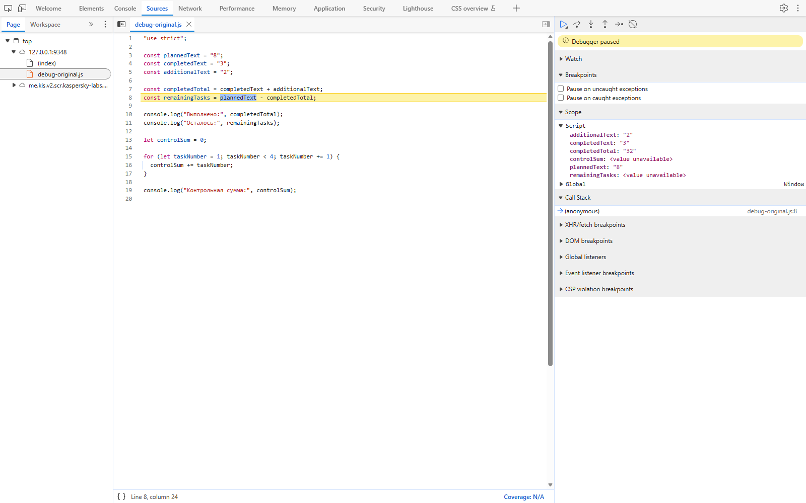

# Практическая работа № 1

## Автор

- Имя: Полякова Дарья
- Группа: ЭФБО-05-25
- Номер в журнале: 22
- Вариант: 6, `((22 - 1) % 8) + 1 = 6`
- Повторная проверка варианта: 6 октября 2026 года

## Окружение

- ОС: Windows
- Node.js: v24.21.0
- npm: 11.19.0
- Git: 2.55.0.windows.5
- Браузер: Edge

## Запуск

Команды выполняются из корня репозитория `tip-js-practices`:

```bash
node practice-01/js/hello.js
node practice-01/js/types.js
node practice-01/js/progress.js
node practice-01/js/plan.js
node practice-01/js/debug.js
```

Для запуска в браузере:

1. Открыть `practice-01/index.html` в Edge.
2. Открыть DevTools клавишей F12 и перейти во вкладку **Console**.
3. Для другого задания заменить в `index.html` значение `src` у единственного
   тега `script`, например на `./js/progress.js`, сохранить файл и обновить страницу.
4. Проверить вывод в консоли. Одновременно подключать только один учебный файл.
5. После проверки вернуть `src="./js/hello.js"`. В итоговой версии подключён именно он.

Входные данные заданий 3 и 4 находятся в начале соответствующего файла.
После проверки других значений восстановлен вариант 6:
`totalTasks = 18`, `completedTasks = 6`, `dailyLimit = 5`.

## Задание 1. Один файл — две среды выполнения

Файл `practice-01/js/hello.js` запущен двумя способами.

| Среда | Способ запуска | Где появился вывод | `typeof document` |
|---|---|---|---|
| Node.js | `node practice-01/js/hello.js` | Терминал | `undefined` |
| Браузер | Открыть `practice-01/index.html`, F12 → Console | Консоль браузера | `object` |

**Различие последней строки.** В Node.js `typeof document` даёт `undefined`, потому что Node.js — среда выполнения JavaScript вне браузера, она не создаёт HTML-страницу и не предоставляет браузерный объект `document`. В браузере этот объект есть, поэтому `typeof document` даёт `object`. Один и тот же код ведёт себя по-разному в зависимости от среды выполнения.


## Задание 2. Исследование типов и преобразований

Файл: `practice-01/js/types.js`. Для каждого выражения сначала
предсказывалось значение и тип, затем результат проверялся через
`console.log()`. Файл запущен в Node.js и в браузере — результаты совпали.

### Таблица проверок

| № | Выражение | Ожидание до запуска | Фактическое значение | Тип результата | Объяснение |
|---|---|---|---|---|---|
| 1 | `"8" + 2` | `"82"` | `"82"` | `string` | Оператор `+` со строкой выполняет конкатенацию: число `2` преобразуется к строке `"2"` и приклеивается к `"8"`. |
| 2 | `"8" - 2` | `6` | `6` | `number` | Оператор `-` не работает со строками, поэтому строка `"8"` преобразуется к числу `8`, затем выполняется вычитание. |
| 3 | `Number("8") + 2` | `10` | `10` | `number` | `Number()` явно преобразует строку `"8"` в число `8`, после чего выполняется арифметическое сложение. |
| 4 | `"12" > "3"` | `false` | `false` | `boolean` | Обе строки сравниваются лексикографически: первый символ `"1"` меньше `"3"`, поэтому `"12" > "3"` ложно. |
| 5 | `12 === "12"` | `false` | `false` | `boolean` | Строгое равенство не преобразует типы. Слева `number`, справа `string` — типы разные, поэтому `false`. |
| 6 | `Number("")` | `0` | `0` | `number` | Пустая строка преобразуется в `0`. Это поведение `Number()`, а не ошибка. |
| 7 | `Number("text")` | `NaN` | `NaN` | `number` | Непреобразуемая строка даёт `NaN` (Not a Number). При этом `typeof NaN` — `"number"`. |
| 8 | `Boolean("false")` | `true` | `true` | `boolean` | Непустая строка всегда даёт `true`, независимо от содержимого. `"false"` — непустая. |
| 9 | `typeof null` | `"object"` | `"object"` | `string` | Историческая особенность JavaScript: `typeof null` возвращает `"object"`, хотя `null` — отдельное примитивное значение. Тип самого результата — `string`. |
| 10 | `typeof NaN` | `"number"` | `"number"` | `string` | `NaN` — это числовое значение, поэтому `typeof NaN` возвращает `"number"`. Тип самого результата — `string`. |

### Что особенно важно

**1. Конкатенация vs вычитание.** `"8" + 2` даёт `"82"`, потому что `+`
со строкой выполняет объединение текста. А `"8" - 2` даёт `6`, потому что
оператор `-` не определён для строк, и JavaScript вынужден приводить
операнды к числам. Один и тот же текст в разных операциях ведёт себя по-разному.

**2. Пустая строка.** `Number("")` возвращает `0`, а не `NaN`. Это значит,
что простая проверка «результат не NaN» не защищает от пустого ввода:
`Number("")` может незаметно превратиться в `0` и попасть в расчёт.
Поэтому в обязательных заданиях 3 и 4 строки вообще не преобразуются в числа:
сначала проверяется тип через `typeof`, затем конечность, целочисленность
и допустимые границы. Пустая строка отклоняется уже при проверке типа.

**3. `NaN` — это `number`.** `typeof NaN` возвращает `"number"`, хотя
`NaN` означает «не число». Поэтому проверки вида `typeof value === "number"`
**недостаточно**: нужно использовать `Number.isFinite(value)` и
`Number.isInteger(value)`.

**4. Непустая строка всегда `true`.** `Boolean("false")` даёт `true`,
потому что `"false"` — непустая строка. Логическое преобразование
не интерпретирует текст как команду.

**5. Особые случаи `typeof`.** `typeof null` возвращает `"object"`,
а `typeof NaN` — `"number"`. В обоих случаях важен и **результат** выражения
(`"object"`, `"number"`), и **тип самого результата** — это `string`,
потому что `typeof` всегда возвращает строку.

### Запуск

**Node.js:**

```bash
node practice-01/js/types.js
```

**Браузер:** для проверки в `practice-01/index.html` подключается `./js/types.js`,
после обновления страницы вывод виден в DevTools → Console.
Перед сдачей подключение возвращено на `./js/hello.js`.

Результаты в обеих средах совпали, потому что `types.js` не использует
браузерные объекты (`document`, `window`) и работает только с базовыми
типами и операторами языка.

## Задание 3. Сводка выполнения задач

Файл: [js/progress.js](./js/progress.js).

Сначала проверяются числовой тип, конечность и целочисленность обоих значений,
затем диапазоны: `0 <= totalTasks <= 1000` и
`0 <= completedTasks <= totalTasks`. При ошибке выводится одно сообщение
с префиксом `Ошибка:`, обычная сводка не рассчитывается.
Для `0, 0` выводится `Задач пока нет`, поэтому деления на ноль нет.

Для допустимых ненулевых данных остаток равен `totalTasks - completedTasks`,
процент — `completedTasks / totalTasks * 100`. Метод `toFixed(1)` используется
только при выводе. Статус определяется по количествам: нет выполненных —
`Не начато`, выполнены все — `Завершено`, иначе — `В работе`.

Фактический вывод для варианта 6:

```text
Всего задач: 18
Выполнено: 6
Осталось: 12
Прогресс: 33.3%
Статус: В работе
```

### Обязательные проверки

Входы указаны в порядке `totalTasks, completedTasks`.
Фактические результаты получены запуском кода в Node.js.
Для повторения проверки нужно изменить константы в начале файла и выполнить
`node practice-01/js/progress.js` из корня репозитория.
После проверок восстановлены значения варианта 6: `18, 6`.

| Входные данные | Ожидаемый результат | Фактический результат | Итог |
|---|---|---|---|
| `18, 6` (вариант 6) | Осталось 12; 33.3%; «В работе» | Осталось 12; 33.3%; «В работе» | Пройдено |
| `12, 5` (общая проверка) | Осталось 7; 41.7%; «В работе» | Осталось 7; 41.7%; «В работе» | Пройдено |
| `0, 0` | «Задач пока нет», без процента | `Задач пока нет`; сводка не выводится | Пройдено |
| `5, 0` | Осталось 5; 0.0%; «Не начато» | Осталось 5; 0.0%; «Не начато» | Пройдено |
| `5, 5` | Осталось 0; 100.0%; «Завершено» | Осталось 0; 100.0%; «Завершено» | Пройдено |
| `5, 6` | Ошибка: выполнено больше общего количества | `Ошибка: выполненных задач больше, чем всего задач.` | Пройдено |
| `-1, 0` | Ошибка: отрицательное количество | `Ошибка: количество задач не может быть отрицательным.` | Пройдено |
| `5, 2.5` | Ошибка: дробное количество | `Ошибка: количество задач должно быть целым.` | Пройдено |
| `"5", 2` | Ошибка: строка вместо числа | `Ошибка: количество задач должно быть задано числами.` | Пройдено |
| `1001, 0` | Ошибка: превышена верхняя граница | `Ошибка: общее количество задач не должно превышать 1000.` | Пройдено |
| `NaN, 0` | Ошибка: недопустимое числовое значение | `Ошибка: количество задач должно быть конечным числом.` | Пройдено |

## Задание 4. План выполнения задач по дням

Файл: [js/plan.js](./js/plan.js).

Количество задач проверяется по тем же правилам, что в задании 3.
Дневная норма должна быть целым числом от 1 до 1000. Она проверяется
даже тогда, когда все задачи уже выполнены. При ошибке цикл не запускается.

Цикл `while` работает, пока остаток больше нуля. За день выполняется
`Math.min(dailyLimit, remainingTasks)` задач. Поэтому остаток уменьшается
на каждой итерации, не становится отрицательным, а последний день может
содержать меньше задач, чем разрешено нормой. При нулевом остатке выводятся
сообщение о завершении и ноль дней. Массивы и собственные функции не используются.

Фактический вывод для варианта 6:

```text
Осталось задач: 12
День 1: выполнено 5, осталось 7
День 2: выполнено 5, осталось 2
День 3: выполнено 2, осталось 0
Потребуется дней: 3
```

### Обязательные проверки

Входы указаны в порядке `totalTasks, completedTasks, dailyLimit`.
Результаты получены запуском кода в Node.js. Для повторения нужно изменить
константы и выполнить `node practice-01/js/plan.js` из корня репозитория.
После проверок восстановлены значения варианта 6: `18, 6, 5`.

| Входные данные | Ожидаемый результат | Фактический результат | Итог |
|---|---|---|---|
| `18, 6, 5` (вариант 6) | 3 дня; по 5, 5, 2 задачи | Дни: 5/5/2 задачи, остатки 7/2/0; `Потребуется дней: 3` | Пройдено |
| `12, 5, 3` (общая проверка) | 3 дня; по 3, 3, 1 задаче | Дни: 3/3/1 задачи, остатки 4/1/0; `Потребуется дней: 3` | Пройдено |
| `10, 4, 3` | 2 дня по 3 задачи | Дни: 3/3 задачи, остатки 3/0; `Потребуется дней: 2` | Пройдено |
| `5, 3, 10` | 1 день, только 2 оставшиеся задачи | `День 1: выполнено 2, осталось 0`; `Потребуется дней: 1` | Пройдено |
| `5, 5, 2` | 0 дней; цикл не выполняется | `Все задачи уже выполнены`; `Потребуется дней: 0` | Пройдено |
| `0, 0, 2` | 0 дней; цикл не выполняется | `Все задачи уже выполнены`; `Потребуется дней: 0` | Пройдено |
| `5, 2, 0` | Ошибка; цикл не запускается | `Ошибка: дневная норма должна быть от 1 до 1000.` | Пройдено |
| `5, 2, 1.5` | Ошибка: дробная дневная норма | `Ошибка: дневная норма должна быть целой.` | Пройдено |
| `5, 6, 2` | Ошибка: выполнено больше общего количества | `Ошибка: выполненных задач больше, чем всего задач.` | Пройдено |
| `5, 2, "2"` | Ошибка: дневная норма задана строкой | `Ошибка: дневная норма должна быть конечным числом.` | Пройдено |
| `5, 2, 1001` | Ошибка: превышена верхняя граница нормы | `Ошибка: дневная норма должна быть от 1 до 1000.` | Пройдено |

### Дополнительные граничные проверки заданий 3 и 4

Помимо 20 обязательных случаев проверены ещё 26 случаев. В их числе —
`Infinity`, `NaN` в разных позициях, отрицательные и строковые значения,
границы диапазона и неверная норма при отсутствии оставшихся задач.
Ниже приведены наиболее показательные результаты; все проверки пройдены.

| Файл и входы | Ожидаемый результат | Фактический результат | Итог |
|---|---|---|---|
| `progress.js`: `0, 1` | Ошибка, а не сообщение об отсутствии задач | `Ошибка: выполненных задач больше, чем всего задач.` | Пройдено |
| `progress.js`: `Infinity, 0` | Ошибка: бесконечное значение | `Ошибка: количество задач должно быть конечным числом.` | Пройдено |
| `progress.js`: `1000, 999` | Осталось 1; 99.9%; «В работе» | Осталось 1; 99.9%; «В работе» | Пройдено |
| `progress.js`: `1000, 1000` | Осталось 0; 100.0%; «Завершено» | Осталось 0; 100.0%; «Завершено» | Пройдено |
| `plan.js`: `5, 5, 0` | Ошибка нормы даже без остатка | `Ошибка: дневная норма должна быть от 1 до 1000.` | Пройдено |
| `plan.js`: `0, 0, NaN` | Ошибка нормы даже без задач | `Ошибка: дневная норма должна быть конечным числом.` | Пройдено |
| `plan.js`: `1000, 0, 1000` | 1 день, 1000 задач | `День 1: выполнено 1000, осталось 0`; `Потребуется дней: 1` | Пройдено |
| `plan.js`: `1000, 0, 1` | 1000 дней по одной задаче; остаток уменьшается до 0 | Проверены все 1000 строк дней; последняя: `День 1000: выполнено 1, осталось 0`; `Потребуется дней: 1000` | Пройдено |

## Задание 5. Поиск логических ошибок через DevTools

Файл: [js/debug.js](./js/debug.js). В нём оставлена исправленная версия.

### Исходная ошибка и результаты запуска

В исходной программе из методички заданы строки `plannedText = "8"`,
`completedText = "3"`, `additionalText = "2"`. Ошибочные выражения:

```js
const completedTotal = completedText + additionalText;
const remainingTasks = plannedText - completedTotal;

for (let taskNumber = 1; taskNumber < 4; taskNumber += 1) {
  controlSum += taskNumber;
}
```

Фактический вывод исходной программы при запуске в Node.js:

```text
Выполнено: 32
Осталось: -24
Контрольная сумма: 6
```

Программа не выбрасывает исключение, но результат неверен: `+` соединяет
две строки, а `-` затем преобразует `"8"` и `"32"` в числа. Условие `< 4`
останавливает цикл до прибавления числа 4.

| Ошибка | Что наблюдалось при запуске | Причина | Исправление | Результат после исправления |
|---|---|---|---|---|
| Обработка количества задач | Выполнено 32; осталось -24 | `"3" + "2"` даёт строку `"32"`; вычитание преобразует строки в числа | Явное преобразование входных строк через `Number()` перед вычислениями | Выполнено 5; осталось 3 |
| Граница цикла | Контрольная сумма 6 | Сложены только 1, 2 и 3: условие `< 4` исключает 4 | Заменить `< 4` на `<= 4` | Контрольная сумма 10 |

Фактический вывод исправленного `debug.js`:

```text
Выполнено: 5
Осталось: 3
Контрольная сумма: 10
```

Ответы вычисляются из исходных строк и в цикле, а не подставляются готовыми
константами. Явное преобразование `plannedText` делает вычитание понятным,
хотя оператор `-` умел преобразовывать эту строку автоматически.

### Наблюдение в отладчике

В Edge выполнена остановка перед сложением в исходной программе и один шаг
**Step over**. Для сохранения ошибочного примера использована отдельная
временная копия `debug-original.js`; итоговый `js/debug.js` содержит исправления.

| Момент проверки | Значение | Тип |
|---|---|---|
| До сложения: `completedText` | `"3"` | `string` |
| До сложения: `additionalText` | `"2"` | `string` |
| После шага: `completedTotal` | `"32"` | `string` |

На скриншоте жёлтым выделена следующая строка — вычисление `remainingTasks`.
Она ещё не выполнена, поэтому значение этой переменной недоступно.
Справа в **Scope → Script** видны обе исходные строки и результат `"32"`.
Это объясняет ошибку до выполнения вычитания.



После вычисления `remainingTasks` в отладчике получено число `-24`.
При остановках внутри исходного цикла наблюдались следующие значения:

| `taskNumber` | `controlSum` до прибавления | `controlSum` после шага |
|---|---|---|
| 1 | 0 | 1 |
| 2 | 1 | 3 |
| 3 | 3 | 6 |

При `taskNumber = 4` условие `< 4` ложно, поэтому четвёртого прибавления нет.
После исправления на `<= 4` программа выполняет и четвёртую итерацию,
а итоговый вывод подтверждает сумму 10.

### Как повторить отладку

1. В `index.html` временно подключить `./js/debug.js`, открыть страницу в Edge
   и перейти в DevTools → **Sources**.
2. Для воспроизведения исходной ошибки временно вернуть два ошибочных выражения
   и условие `< 4`, показанные выше. Остальные строки сохранить.
3. Поставить точку останова на строке вычисления `completedTotal` и обновить страницу.
   До её выполнения посмотреть `completedText`, `additionalText` и их типы.
4. Выполнить **Step over** (F10). Сравнить значение и тип `completedTotal`
   с исходными операндами. Для проверки типа в Console используется `typeof`.
5. Поставить точку останова на `controlSum += taskNumber` и проследить значения
   `taskNumber` и `controlSum`, продолжая выполнение до завершения цикла.
6. Восстановить `Number(completedText) + Number(additionalText)`,
   `Number(plannedText) - completedTotal` и условие `<= 4`.
   Повторить запуск в браузере и Node.js: должны получиться 5, 3 и 10.
7. Удалить активные точки останова и вернуть подключение `./js/hello.js` в HTML.

## Итоговая проверка в двух средах

6 октября 2026 года повторно проверены данные варианта 6 в Node.js и Edge,
а также 20 общих случаев заданий 3 и 4. Ошибок нет.
Фактический протокол: [variant-checks-output.txt](./variant-checks-output.txt).

Все пять файлов запущены через Node.js и отдельно в Edge.
Для браузерной проверки каждый файл подключался к отдельной проверочной
странице; итоговый `index.html` оставлен с `hello.js`.
Необработанных исключений при выполнении учебных скриптов не обнаружено.

| Файл | Node.js | Edge | Итог |
|---|---|---|---|
| `hello.js` | Имя, группа и номер работы; `typeof document` — `undefined` | Те же сведения; `typeof document` — `object` | Ожидаемое различие сред |
| `types.js` | Все 10 значений и типов совпали с таблицей задания 2 | Те же значения и типы | Пройдено |
| `progress.js` | Осталось 12; 33.3%; «В работе» | Тот же результат | Пройдено |
| `plan.js` | По дням 5, 5, 2; всего 3 дня | Тот же результат | Пройдено |
| `debug.js` | Выполнено 5; осталось 3; сумма 10 | Тот же результат | Пройдено |

## Вывод

В работе показан запуск одного JavaScript-файла в Node.js и браузере,
исследованы типы и преобразования, реализованы проверки входных данных,
расчёт прогресса и пошаговый план с помощью `while`.
Граничные случаи обрабатываются до вычислений: нет деления на ноль,
отрицательного остатка или запуска цикла с нулевой нормой.

Наиболее показательная ошибка — сложение строк `"3"` и `"2"`:
программа выполняется без исключения, но получает `"32"` вместо числа 5.
Проверка типов и наблюдение за промежуточными значениями объясняют причину.
Вторая ошибка показывает, почему нужно проверять обе границы цикла.
Дополнительное задание из раздела 8 методички не выполнялось.
