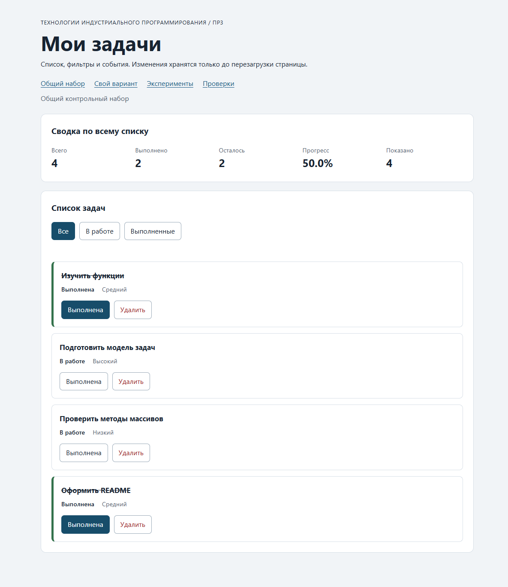

# Практическая работа № 3. Работа с DOM и событиями

## Данные работы

| Поле | Значение |
|---|---|
| Имя | Полякова Дарья |
| Группа | ЭФБО-05-25 |
| Номер в журнале | 22 |
| Вариант из ПР2 | 6, `((22 - 1) % 8) + 1 = 6` |
| Повторная проверка варианта | 6 октября 2026 года |
| Node.js | v24.21.0 |
| npm | 11.19.0 |
| Git | 2.55.0.windows.5 |
| Браузер | Microsoft Edge 154.0.4258.53 |
| Операционная система | Windows |
| Дата проверки | 5 октября 2026 года |

Реализован браузерный список задач: статусы, удаление, три фильтра, сводка
по всему списку, количество видимых записей и сообщения о пустых состояниях.

## Запуск

Рабочая папка: `practice-03` внутри личного репозитория.

```bash
npm.cmd run check:service
npm.cmd start
```

Устанавливать зависимости через `npm install` не требуется. В PowerShell
используются команды выше; в терминале с доступным `npm` можно убрать `.cmd`.
Альтернатива из корня репозитория `tip-js-practices`:

```bash
node practice-03/checks/service.checks.js
node practice-03/tools/serve.mjs
```

```text
http://127.0.0.1:5503/
http://127.0.0.1:5503/index.html?dataset=variant
http://127.0.0.1:5503/examples/dom-events.html
http://127.0.0.1:5503/checks.html
```

Проверка проводилась на порту `5503`. Остановка сервера: `Ctrl+C`.
Если порт занят, из папки `practice-03` выполнить `node tools/serve.mjs 5504`
и заменить порт во всех адресах на `5504`. Страницы нужно открывать через HTTP,
а не двойным щелчком по HTML: используются браузерные ES-модули.
Изменения хранятся только в памяти страницы; после перезагрузки исходный набор
восстанавливается. Автоматической перезагрузки после правки кода нет.

## Что перенесено из ПР2

В новую папку перенесены собственные [src/task-service.js](./src/task-service.js)
и [src/data.js](./src/data.js) из `practice-02/src`. Сохранены все девять функций,
общий набор `[1, 4, 7, 10]`, номер варианта и шесть собственных задач.
Копии не потребовали исправлений: все 35 проверок сервиса прошли.
Импорты внутри ПР3 обращаются к её собственным файлам, поэтому для запуска
не требуется соседняя папка ПР2. Предыдущие работы сохранены без изменений.

## Эксперименты

| № | До запуска: прогноз | После запуска: результат | Объяснение |
|---:|---|---|---|
| 1. Отсутствующий элемент и коллекция | `null`, длина коллекции 0 | `null`; длина 0 | `querySelector` не нашёл элемент, `querySelectorAll` вернул пустую коллекцию. Обращение к свойствам `null` без проверки вызвало бы ошибку. |
| 2. dataset и числовой id | `"23"` (string), после Number — 23 (number) | `"23"`, тип string; 23, тип number | Значения `dataset` являются строками. На границе обработчика выполняется явное преобразование. |
| 3. Статический NodeList | После двух добавлений старый список — 1, новые запросы — 2 и 3 | Старый список: 1 и 1; новые запросы: 2 и 3 | Ранее полученный `NodeList` — снимок; новый запрос видит добавленные DOM-узлы. |
| 4. Строка с HTML-разметкой | Буквальный текст `<strong>Это текст, а не HTML</strong>`, элементов strong нет | Текст совпал, дочерних элементов у заголовка 0 | `textContent` не разбирает строку как HTML. |
| 5. Распространение события | По span: card (захват, 1) → button (всплытие, 3) → card (всплытие, 3); target всегда lab-label | Фазы 1 → 3 → 3; target всегда lab-label; currentTarget: lab-card → lab-button → lab-card | Непосредственная цель — вложенный span. Обработчик родительской кнопки вызывается на фазе всплытия, а не на фазе цели. |

Прогнозы записаны до запуска страницы экспериментов. Фактический журнал
нажатия на `span#lab-label`:

```text
1. phase=1; target=lab-label; currentTarget=lab-card
2. phase=3; target=lab-label; currentTarget=lab-button
3. phase=3; target=lab-label; currentTarget=lab-card
```

Дополнительно отладчик был остановлен на строке 25
[examples/dom-events.js](./examples/dom-events.js), перед `record(event)`
в обработчике кнопки. Получены `event.target.id = "lab-label"`,
`event.currentTarget.id = "lab-button"`, `event.eventPhase = 3`.

## Организация кода

| Модуль | Ответственность |
|---|---|
| [task-service.js](./src/task-service.js) | Функции ПР2: поиск, сводка, изменение статуса и удаление без изменения входных данных. DOM и обработчиков здесь нет. |
| [task-selectors.js](./src/task-selectors.js) | `getVisibleTasks`: новый массив всех, невыполненных либо выполненных задач. Исходные записи и порядок сохраняются. |
| [task-view.js](./src/task-view.js) | Создание карточек DOM-методами, обновление списка, сводки и пустого сообщения. Названия и сообщения выводятся через `textContent`. |
| [main.js](./src/main.js) | Полный массив `currentTasks`, выбранный `currentFilter`, делегированные обработчики списка и фильтров, вызовы сервиса и отрисовки. |

`renderApp` рассчитывает видимую выборку отдельно от полного массива.
Общая сводка получается через `getTaskStats(currentTasks)`, а «Показано» —
из длины выборки. Фильтрация не заменяет полный массив.

`renderTaskList` использует `replaceChildren`: заменяются карточки, но не
контейнер `ul#task-list`. Обработчики подписаны один раз вне отрисовки.
Кнопка распознаётся через `closest`, проверяется её принадлежность контейнеру,
допустимое действие и идентификатор. `toggle` вызывает `findTaskById` и
`setTaskCompleted`, `delete` — `removeTask`. Новый массив принимается только
при `result.ok === true`. После отрисовки вызывается `restoreTaskFocus`.

Выполненная карточка отмечена классом `is-completed`, текстом `Выполнена`
и `aria-pressed="true"` у кнопки статуса. Подпись кнопки остаётся постоянной.
Для фильтров согласованно обновляются `is-active` и `aria-pressed`.

## Общий сценарий

Ожидания взяты из раздела 6.5 методички. Ниже — результаты последовательных
действий в Edge. При нажатии использовались в том числе вложенные подписи кнопок.

| Шаг | Видимые id | Всего | Выполнено | Осталось | Прогресс | Показано | Сообщение | Совпало с ожиданием |
|---:|---|---|---|---|---|---|---|---|
| 0. Начальное состояние | `[1, 4, 7, 10]` | 4 | 2 | 2 | 50.0% | 4 | Нет | Да |
| 1. Фильтр «В работе» | `[4, 7]` | 4 | 2 | 2 | 50.0% | 2 | Нет | Да |
| 2. Выполнить 4 | `[7]` | 4 | 3 | 1 | 75.0% | 1 | Нет | Да |
| 3. Фильтр «Все» | `[1, 4, 7, 10]` | 4 | 3 | 1 | 75.0% | 4 | Нет | Да |
| 4. Удалить 7 | `[1, 4, 10]` | 3 | 3 | 0 | 100.0% | 3 | Нет | Да |
| 5. Фильтр «В работе» | `[]` | 3 | 3 | 0 | 100.0% | 0 | Нет задач по выбранному фильтру. | Да |
| 6. «Все», переключить 1 | `[1, 4, 10]` | 3 | 2 | 1 | 66.7% | 3 | Нет | Да |
| 7. Удалить 1, 4, 10 | `[]` | 0 | 0 | 0 | 0.0% | 0 | Список задач пуст. | Да |

После перезагрузки восстановились `[1, 4, 7, 10]`, сводка 4 / 2 / 2 / 50.0%,
показано 4. Это ожидаемо: сохранение между загрузками относится к ПР4.

## Индивидуальный вариант

Повторная проверка варианта 6 выполнена 6 октября 2026 года.
Фактический протокол: [variant-checks-output.txt](./variant-checks-output.txt).

Вариант 6: **проверка пользовательского интерфейса**. Используется исходный набор ПР2,
а не результат её консольного сценария. Первые пять задач выполнены, задача 64 не выполнена.

| id | Название | Приоритет |
|---|---|---|
| 11 | Проверить навигацию интерфейса | high |
| 23 | Проверить поля формы | medium |
| 37 | Проверить сообщения об ошибках | low |
| 41 | Проверить адаптивность страницы | high |
| 58 | Проверить управление с клавиатуры | medium |
| 64 | Оформить отчёт о проверке интерфейса | low |

До действий проверены все три фильтра: «Все» показывает шесть задач,
«В работе» — только 64, «Выполненные» — 11, 23, 37, 41, 58.
Прогноз: переключение 23 снимет выполнение, затем удаление выполненной 37
оставит три выполненные задачи из пяти, прогресс 60.0%.
После возвращения во «Все» выполнены переключение 23 и удаление 37.

| Этап | Всего | Выполнено | Осталось | Прогресс | Видимые id |
|---|---|---|---|---|---|
| До действий | 6 | 5 | 1 | 83.3% | `[11, 23, 37, 41, 58, 64]` |
| После переключения 23 | 6 | 4 | 2 | 66.7% | `[11, 23, 37, 41, 58, 64]` |
| После удаления 37 | 5 | 3 | 2 | 60.0% | `[11, 23, 41, 58, 64]` |
| Итог, фильтр «В работе» | 5 | 3 | 2 | 60.0% | `[23, 64]` |
| Итог, фильтр «Выполненные» | 5 | 3 | 2 | 60.0% | `[11, 41, 58]` |

Фактический результат совпал с ожиданием для варианта 6. Названия и приоритеты
оставшихся записей сохранились. Экспортированный `variantTasks` не изменился.

## Протокол проверки сервиса

Команда `npm.cmd run check:service` выполнена из папки `practice-03`.
Полный фактический вывод сохранён в [service-checks-output.txt](./service-checks-output.txt).

```text
Проверок пройдено: 35; не пройдено: 0.
```

## Протокол браузерных проверок

Страница `http://127.0.0.1:5503/checks.html` запущена в Edge.
Реальный текст её блока «Текстовый протокол» сохранён в
[browser-checks-output.txt](./browser-checks-output.txt).

```text
Всего: 36. Пройдено: 36. Ошибок: 0.
```

## Собственные проверки

| № | Исходное состояние и действия | Ожидаемый результат | Фактический результат | Итог |
|---:|---|---|---|---|
| 1 | Удалить 1, 4, 7; в фильтре «Выполненные» переключить оставшуюся 10 | Всего 1, выполнено 0, прогресс 0.0%, показано 0; сообщение об отсутствии совпадений; фокус на фильтре | 1 / 0 / 1 / 0.0%, показано 0; сообщение «Нет задач по выбранному фильтру.»; фокус на completed; «Все» возвращает id 10 | Пройдено |
| 2 | Сделать 5 быстрых переключений id 4 с получением новой кнопки после каждой отрисовки | Прогресс 75%; выполнены 1, 4, 10; карточек 4; одно изменение на одно нажатие | 4 / 3 / 1 / 75.0%, четыре карточки, id 4 выполнена | Пройдено |
| 3 | Изменить задачи варианта, затем импортировать data.js и сравнить исходные наборы | demoTasks и variantTasks совпадают с копиями до действий | Сравнение всех полей обоих экспортированных массивов до и после действий подтвердило равенство | Пройдено |

Первый случай проверяет границу с единственной оставшейся задачей, второй —
события и повторную отрисовку. Все три выполнены в настоящем браузере.
Необработанных исключений в проверяемых страницах не обнаружено.

## Отладка и клавиатура

В отладчике Edge через Chrome DevTools Protocol выполнены реальные остановки
на строках 47, 62 и 67 [src/main.js](./src/main.js). Нажатие — на вложенную
подпись кнопки статуса задачи id 4 при фильтре «Все».

| Остановка | Полученные значения |
|---|---|
| Строка 47, перед чтением dataset | `event.target = SPAN.action-label`; `event.currentTarget = UL#task-list`; `card.dataset.taskId = "4"`, тип string; действие `toggle` |
| Строка 62, перед вызовом сервиса | `rawId = "4"`; `id = 4`, тип number; найдена «Подготовить модель задач», `completed: false`, `priority: "high"` |
| Строка 67, после вызова сервиса | `result.ok = true`; новый массив из четырёх задач; у id 4 `completed: true`; исходный объект всё ещё содержит false; ссылки на массивы и изменённые объекты различаются |
| После продолжения | Карточка id 4 выполнена, сводка 4 / 3 / 1 / 75.0%, фокус на её кнопке статуса |

Для повторения: открыть F12 → Sources → `src/main.js`, поставить точки
останова на указанных строках и нажать на подпись «Выполнена» задачи id 4.
Просмотреть переменные в Scope или Console, затем продолжить выполнение.
Точки останова использовались только в отдельном проверочном экземпляре браузера;
операторы `debugger` в исходный код не добавлены.

**Проверка клавиатуры:** клавиши передавались браузеру как события ввода,
без замены активации вызовом `.click()`.

| Действие | Фактический результат |
|---|---|
| Фокус на «Все», Tab, Enter | Tab переводит фокус на «В работе», Enter выбирает фильтр; видимы `[4, 7]` |
| Два Tab до кнопки статуса id 4, Space | Задача выполнена и исчезла из «В работе»; видима id 7; фокус восстановлен на активном фильтре |
| Вернуться во «Все», через Tab выбрать кнопку id 1, Enter | Статус id 1 изменился; после замены карточек фокус остался на её новой кнопке статуса |
| Tab на «Удалить» id 1, Enter | Задача удалена; фокус перешёл на активный фильтр «Все» |

**Ошибочные идентификаторы:** в DOM временно менялся атрибут карточки id 4.

| Значение и действие | Фактический отказ | Состояние после выбора «Все» |
|---|---|---|
| `777`, удалить | `Ошибка: Задача с id 777 не найдена.` | `[1, 4, 7, 10]`, 4 / 2 / 2 / 50.0%, сообщение очищено |
| `4abc`, переключить | `Ошибка: идентификатор задачи должен быть положительным целым числом.` | `[1, 4, 7, 10]`, 4 / 2 / 2 / 50.0%, сообщение очищено |

`Number("4abc")` даёт `NaN` и отклоняется проверкой. Использование `parseInt`
здесь было бы ошибкой: оно могло бы превратить некорректную строку в id 4.

## Вид приложения

Снимки получены после запуска приложения в Edge:



[Вариант 6 после переключения 23 и удаления 37: пять задач, прогресс 60%](./screenshots/variant.png).

## Дополнительное задание

Дополнительное задание не выполнялось.

## Вывод

Прикладная логика ПР2 подключена к браузерному интерфейсу. Источник состояния —
полный массив задач, а DOM отображает его текущую выборку. Удаление карточки
только из DOM не изменило бы данные; поэтому действия вызывают сервис,
а затем выполняется согласованная перерисовка.

Делегирование позволяет одному обработчику контейнера обслуживать новые
карточки и вложенные подписи кнопок. Разделение `target` и `currentTarget`
подтверждено экспериментами и остановками в отладчике. Не возникли ошибки
частичного разбора id, потери скрытых задач или накопления обработчиков:
идентификатор проверяется целиком, фильтр не меняет полный массив,
а подписки создаются вне `renderApp`.

Пройдены 35 проверок сервиса и 36 браузерных сценариев, выполнены три собственных
случая, оба набора данных и проверка клавиатуры. Дополнены текстовые протоколы
и фактические изображения интерфейса.

Код и отчёт: [практическая работа № 3](https://github.com/MrDary-art/tip-js-practices/tree/main/practice-03).
