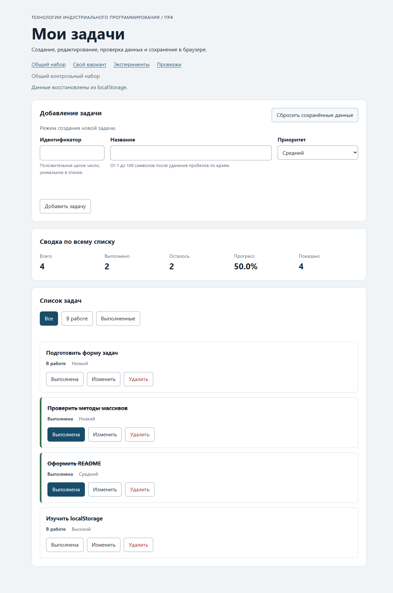

# Практическая работа № 4. Формы, валидация и локальное хранение данных

## Данные работы

| Поле | Значение |
|---|---|
| Имя | Полякова Дарья |
| Группа | ЭФБО-05-25 |
| Вариант из ПР2–ПР3 | 1 — подготовка учебного проекта |
| Дата проверки | 05.10.2026 |
| Node.js / npm | v24.21.0 / 11.19.0 |
| Браузер | Microsoft Edge 154.0.4258.53 |
| ОС | Windows, версия 25H2, сборка 26200.9550 |

Решение находится в `practice-04` рядом с `practice-01`, `practice-02` и `practice-03`. Задание взято из [методички](../practices/practice-04/README.md). Материалы задания и предыдущие решения сохранены без изменений.

## Запуск

Из корня репозитория:

```powershell
cd practice-04
npm.cmd test
npm.cmd start
```

Зависимостей нет, `npm install` не требуется. В PowerShell использован `npm.cmd`; обычные команды `npm test` и `npm start` также предусмотрены в `package.json`.

- [Общий набор](http://127.0.0.1:5504/)
- [Вариант 1](http://127.0.0.1:5504/index.html?dataset=variant)
- [Пять экспериментов](http://127.0.0.1:5504/examples/forms-storage.html)
- [Браузерные проверки](http://127.0.0.1:5504/checks.html)

Сервер запускается только на `127.0.0.1:5504`. Для повторения проверок нужно сохранять этот адрес и порт: другой origin имеет другое хранилище. Открытие HTML через `file://` не используется.

## Перенос результата ПР3

Скопирован комплект `starter/practice-04`, затем четыре модуля из своего решения ПР3. До внесения изменений выполнена регрессионная проверка: **35 пройдено, 0 ошибок**. `main.js` взят из стартового комплекта ПР4 и дополнен.

| Файл | Что перенесено или изменено |
|---|---|
| `data.js` | Без изменений: общий набор и шесть задач варианта 1. |
| `task-service.js` | Все прежние операции; добавлена `updateTask`, сохраняющая `id`, `completed`, порядок и исходные объекты. |
| `task-selectors.js` | Без изменений: фильтры `all`, `pending`, `completed`. |
| `task-view.js` | Список, сводка и пустые состояния; добавлена третья кнопка `edit` с вложенной подписью «Изменить». |

## Эксперименты с формой и хранилищем

Прогнозы записаны [до запуска экспериментов](./checks/experiment-plan.txt). Фактические наблюдения получены в Edge на `examples/forms-storage.html`; события и свойства прочитаны из работающей страницы. До начала удалён отдельный учебный ключ `tip-js-practice-04:lab`.

| № | До запуска: прогноз | После запуска: результат | Объяснение |
|---:|---|---|---|
| 1. Пустое обязательное поле | Браузер остановит отправку до `submit`; журнал останется прежним. | Счётчик `submit = 0`, `validity.valid = false`, сообщение «Заполните это поле.». Журнал не изменился, ключ отсутствует. | HTML-ограничение `required` проверяется до события отправки. |
| 2. Название из пробелов | `required` пропустит, прикладная проверка отклонит. | `submit = 1`, `customError = true`, `validity.valid = false`; «Название не должно состоять только из пробелов.». Записи нет. | Строка не пустая до `trim`; `setCustomValidity` делает поле невалидным. |
| 3. Типы значений `FormData` | Значения будут строками, переход отменится, краевые пробелы исчезнут. | Для `  Проверить JSON  ` и `high`: `submit.defaultPrevented: true`, тип названия `string`, сохранено `Проверить JSON`. | `FormData` собирает строковые значения; `preventDefault` отменяет стандартную отправку; нормализация выполняется явно. |
| 4. Строка и JSON | `getItem` вернёт строку, `JSON.parse` восстановит объект. | `typeof localStorage value: string`; строка `{"title":"Проверить JSON","priority":"high"}`, восстановленный объект имеет те же два поля. | Хранилище не сохраняет JavaScript-объекты напрямую. |
| 5. Повреждённый JSON | Разбор выбросит `SyntaxError`, обработчик покажет сообщение. | Для `{broken-json` выведено «JSON.parse завершился ошибкой: Expected property name or '}' in JSON at position 1 (line 1 column 2)». Страница продолжила работать. | `try/catch` отделяет ошибку разбора от остального приложения. |

После экспериментов учебный ключ удалён.

## Организация кода

`task-service.js` выполняет операции над корректной моделью без изменения входа. `form-validation.js` принимает черновик, собирает независимые ошибки всех полей и возвращает нормализованные значения. В режиме редактирования используется `editingId`, поскольку заблокированный `id` отсутствует в `FormData`.

`task-storage.js` проверяет схему всего массива, уникальность id, нормализованные названия, тип статуса и приоритет. Он сериализует оболочку `{ version: 1, tasks }` и перехватывает ошибки чтения, записи и удаления. Аргумент `storage` позволяет использовать имитацию хранилища в проверках. Успешный `JSON.parse` подтверждает только синтаксис, поэтому далее проверяются версия и поля; ошибочная запись отклоняется целиком, без исправления на месте. Исходный набор копируется вместе с объектами задач.

`task-view.js` безопасно выводит пользовательские названия через `textContent`. `main.js` хранит состояние, режим формы и фильтр, связывает события с сервисом, сохранением и отрисовкой. Обработчики установлены один раз на форму и контейнеры. Нажатие вложенной подписи распознаётся через `closest`.

Сохранение выполняется после успешных `add`, `update`, `toggle`, `delete`. Начальный запуск, выбор фильтра, начало/отмена редактирования и `renderApp` не записывают данные. Сброс удаляет только ключ выбранного набора и не сохраняет исходный массив обратно.

Ключи: `tip-js-practice-04:demo` и `tip-js-practice-04:variant`. Проверки используют отдельные `tip-js-practice-04:checks:demo` и `tip-js-practice-04:checks:variant`. `localStorage.clear()` не вызывается. Недоступность самого свойства `window.localStorage` также обработана: приложение работает в памяти и показывает предупреждение.

## Проверка формы

| Сценарий | Ожидаемый результат | Фактический результат | Итог |
|---|---|---|---|
| Добавить `20`, `  Изучить localStorage  `, `high` | Новая задача с нормализованным названием и `completed: false` | id в конце списка; сохранены `Изучить localStorage`, `high`, `false`; поля очищены | Пройдено |
| Повторный `id = 4` | Отказ без изменения списка и записи | Ошибка около id, `aria-invalid="true"`; массив и строка storage прежние, дополнительного `setItem` нет | Пройдено |
| Пустое название при корректном id | Нативный отказ | `submit` не вызван; «Заполните это поле.», записи нет | Пройдено |
| Название из пробелов | Отказ после `trim` | Ошибка названия, `customError`, список прежний | Пройдено |
| Название длиной 100 | Успех | Добавлена задача `30`, сохранено ровно 100 символов | Пройдено |
| Название длиной 101 | Отказ | Программно установлено 101 значение; прикладная проверка отклонила, строка storage не изменилась | Пройдено |
| Редактирование выполненной задачи `1` | Изменятся только title и priority | `Изучить формы`, `low`; `id = 1`, `completed = true`, порядок сохранены | Пройдено |
| Отмена редактирования | Пустая форма создания | Поле id включено и получает фокус, кнопка отмены скрыта, записи нет | Пройдено |

`maxlength` ограничивает обычный пользовательский ввод. Значение длиной 101 установлено программно, чтобы проверить также прикладную границу. Исправление поля вызывает `input` и снимает его собственную ошибку через `setCustomValidity("")`; ошибки остальных полей не стираются этим обработчиком.

## Общий сценарий

Ожидания взяты из таблицы 6.8 методички до запуска. Ниже фактические данные интерфейса; все значения совпали с ожидаемыми. Во всех шагах выбран фильтр «Все».

| Шаг | Действие | Видимые id | Всего | Выполнено | Осталось | Прогресс | Состояние storage |
|---:|---|---|---:|---:|---:|---:|---|
| 0 | Исходный запуск после сброса | `[1,4,7,10]` | 4 | 2 | 2 | 50.0% | Ключ отсутствует |
| 1 | Добавление `20`, `Изучить localStorage`, `high` | `[1,4,7,10,20]` | 5 | 2 | 3 | 40.0% | Версия 1, пять задач |
| 2 | Отказ для повторного `4` | `[1,4,7,10,20]` | 5 | 2 | 3 | 40.0% | Строка не изменилась |
| 3 | `4`: `Подготовить форму задач`, `low` | `[1,4,7,10,20]` | 5 | 2 | 3 | 40.0% | Новые title и priority; completed остался false |
| 4 | Переключение `7` | `[1,4,7,10,20]` | 5 | 3 | 2 | 60.0% | У задачи 7 completed = true |
| 5 | Удаление `1` | `[4,7,10,20]` | 4 | 2 | 2 | 50.0% | Четыре оставшиеся задачи |
| 6 | Перезагрузка страницы | `[4,7,10,20]` | 4 | 2 | 2 | 50.0% | Прочитана та же строка; «Данные восстановлены из localStorage.» |
| 7 | Сброс данных | `[1,4,7,10]` | 4 | 2 | 2 | 50.0% | Ключ отсутствует |

После сценария в текущий ключ через выполнение JavaScript в браузере записана строка `{broken-json`, выполнена перезагрузка. Фактически показаны исходные четыре задачи и предупреждение о невозможности прочитать данные. Приложение продолжило работать; затем выполнен сброс.

## Проверка восстановления и ошибок

| Случай | Ожидание | Фактический результат | Итог |
|---|---|---|---|
| Записи нет | Независимая копия исходного набора | `source: initial`; массив и объекты не совпадают по ссылке с исходными, на странице 4 задачи, ключ не создан | Пройдено |
| Корректная запись | Восстановление после перезагрузки | Сохранены id, порядок, названия, приоритеты и статусы; сообщение о восстановлении | Пройдено |
| Повреждённый JSON | Исходный набор и предупреждение | После `{broken-json` показаны `[1,4,7,10]`, класс `is-warning` | Пройдено |
| Неверная версия или схема | Отклонение всего списка | Модульные проверки версии 999 и строкового completed дают `source: fallback`; браузерная проверка неверной схемы показывает исходный набор | Пройдено |
| Сброс | Удаление только текущего ключа | `getItem` возвращает null; другой ключ сохранён в модульной проверке | Пройдено |
| Общий и индивидуальный наборы | Независимые изменения | После изменения варианта общий набор остался `[1,4,7,10]`; проверка отдельных ключей также пройдена | Пройдено |
| Ошибка чтения | Управляемый fallback | Исключение `getItem` перехвачено модульной проверкой; при недоступном getter браузер запустил исходный набор | Пройдено |
| Ошибка записи | Состояние на странице обновится с предупреждением | При `QuotaExceededError` добавлена задача 32, ключ не создан; после перезагрузки вернулись исходные четыре | Пройдено |
| Ошибка удаления | Сообщение о неудачном удалении | При недоступном storage сброс показал исходный набор и предупреждение, что после перезагрузки может вернуться прежняя запись | Пройдено |

## Индивидуальный вариант

Вариант 1, подготовка учебного проекта. Все шесть исходных задач имеют `completed: false`.

| id | Исходное название | Приоритет |
|---:|---|---|
| 11 | Определить тему учебного проекта | high |
| 23 | Составить план работы | medium |
| 37 | Подобрать учебные материалы | low |
| 41 | Подготовить структуру проекта | high |
| 58 | Реализовать основные функции | medium |
| 64 | Оформить отчёт по проекту | low |

Прогноз: после добавления 75 будет 7 невыполненных задач; редактирование не меняет счётчики; удаление 37 оставит 6 невыполненных и 0.0%; перезагрузка сохранит изменения, сброс восстановит исходные шесть. Фактическая последовательность:

| Этап | Всего | Выполнено | Осталось | Прогресс | Видимые id |
|---|---:|---:|---:|---:|---|
| Исходный набор | 6 | 0 | 6 | 0.0% | `[11,23,37,41,58,64]` |
| После добавления `75` | 7 | 0 | 7 | 0.0% | `[11,23,37,41,58,64,75]` |
| После редактирования `23` | 7 | 0 | 7 | 0.0% | `[11,23,37,41,58,64,75]` |
| После удаления `37` | 6 | 0 | 6 | 0.0% | `[11,23,41,58,64,75]` |
| После перезагрузки | 6 | 0 | 6 | 0.0% | `[11,23,41,58,64,75]` |
| После сброса | 6 | 0 | 6 | 0.0% | `[11,23,37,41,58,64]` |

Добавлена `75`: «Подготовить презентацию учебного проекта», `medium`. Задача `23` изменена на «Уточнить план учебного проекта», `high`; её статус остался false. После перезагрузки проверены эти поля и отсутствие 37. Общий набор не изменился. После сброса варианта 37 вернулась, 75 отсутствует, ключ варианта удалён. Ветвлений по номеру варианта в реализации нет.

## Протокол проверок сервиса и новых модулей

Фактический вывод `npm.cmd test`, включающий `check:service` и `check:modules`. Полная копия также сохранена в [текстовом файле](./checks/node-checks-output.txt). Исходные файлы проверок не редактировались.

```text
> tip-js-practice-04@1.0.0 test
> npm run check:service && npm run check:modules


> tip-js-practice-04@1.0.0 check:service
> node checks/service.checks.js

OK: 01. Создание задачи с явным приоритетом
OK: 02. Приоритет по умолчанию
OK: 03. Удаление краевых пробелов без изменения внутренних
OK: 04. Граничные длины названия и положительный безопасный id
OK: 05. Некорректные названия при создании
OK: 06. Некорректные идентификаторы при создании
OK: 07. Все допустимые приоритеты и отклонение недопустимых
OK: 08. Каждый вызов createTask возвращает новый объект
OK: 09. Поиск по id, а не по индексу
OK: 10. Отсутствующая задача и пустой массив при поиске
OK: 11. Поиск не преобразует строковый id в число
OK: 12. Получение невыполненных задач
OK: 13. Пустой список, все выполнены и все не выполнены
OK: 14. Названия в исходном порядке и пустой список
OK: 15. Сводка по общему набору
OK: 16. Сводка по пустому списку
OK: 17. Сводка: ничего не выполнено и выполнено всё
OK: 18. Процент остаётся числом без предварительного округления
OK: 19. Добавление в конец без изменения входного массива
OK: 20. Добавление в пустой список с приоритетом по умолчанию
OK: 21. Повторяющийся id отклоняется
OK: 22. Добавление не обходит проверки createTask
OK: 23. Изменение completed в обе стороны
OK: 24. completed принимает только boolean
OK: 25. Некорректный или отсутствующий id при изменении статуса
OK: 26. Повторная установка статуса создаёт новый результат
OK: 27. Переименование сохраняет остальные поля
OK: 28. Проверки названия при переименовании
OK: 29. Некорректный или отсутствующий id при переименовании
OK: 30. Удаление по id с сохранением порядка
OK: 31. Удаление единственной записи
OK: 32. Некорректный, отсутствующий id и удаление из пустого списка
OK: 33. Входные объекты не изменяются ни одной операцией
OK: 34. Общий сценарий и все промежуточные сводки
OK: 35. Работа с другим набором, без зависимости от demoTasks

Проверок пройдено: 35; не пройдено: 0.

> tip-js-practice-04@1.0.0 check:modules
> node checks/modules.checks.js

OK: 01. updateTask изменяет название и приоритет выбранной задачи
OK: 02. updateTask нормализует название и сохраняет completed
OK: 03. updateTask не изменяет входной массив и объекты
OK: 04. updateTask отклоняет некорректный и отсутствующий id
OK: 05. updateTask отклоняет некорректные название и приоритет
OK: 06. Валидация создания нормализует поля
OK: 07. Валидация отклоняет некорректные id
OK: 08. Валидация отклоняет повторяющийся id при создании
OK: 09. Валидация проверяет название после trim
OK: 10. Валидация принимает только три приоритета
OK: 11. В режиме редактирования используется editingId
OK: 12. Редактирование отсутствующей задачи отклоняется
OK: 13. Валидация не изменяет draft и список
OK: 14. Проверка схемы принимает корректный список
OK: 15. Проверка схемы отклоняет неверную структуру
OK: 16. Отсутствующая запись возвращает независимую копию исходных данных
OK: 17. Корректная запись восстанавливается из хранилища
OK: 18. Повреждённый JSON приводит к безопасному fallback
OK: 19. Неизвестная версия приводит к безопасному fallback
OK: 20. Некорректные задачи из JSON не принимаются
OK: 21. Ошибка getItem перехватывается
OK: 22. Сохранение записывает версию и задачи
OK: 23. Некорректный список не записывается
OK: 24. Ошибка setItem перехватывается
OK: 25. Удаляется только переданный ключ
OK: 26. Ошибка removeItem перехватывается
OK: 27. Результат загрузки не разделяет объекты с fallback

Проверок пройдено: 27; не пройдено: 0.
```

## Протокол браузерных проверок

Фактический текст из `checks.html` после запуска в Edge. Полная копия: [browser-checks-output.txt](./checks/browser-checks-output.txt).

```text
OK: Фильтры ПР3 сохраняют порядок и не изменяют вход
OK: Карточка содержит toggle, edit и delete
OK: Название задачи выводится как текст
OK: Повторная отрисовка списка не накапливает карточки
OK: Сводка использует полный список и отдельный visibleCount
OK: Пустые состояния различают список и фильтр
OK: Приложение запускается с исходным набором
OK: Корректная форма добавляет задачу и сохраняет данные
OK: Повторяющийся id отклоняется без записи
OK: Название из пробелов отклоняется прикладной проверкой
OK: Нативные ограничения не пропускают пустую форму
OK: Кнопка edit заполняет форму и блокирует id
OK: Редактирование меняет title и priority, сохраняя completed
OK: Отмена редактирования возвращает режим создания
OK: Успешная отправка очищает ошибки и форму
OK: Изменение статуса сохраняется
OK: Удаление сохраняется
OK: Фильтр не записывается, но сохраняется после изменения данных
OK: Перезагрузка восстанавливает сохранённые задачи
OK: Сброс удаляет ключ и восстанавливает исходный набор
OK: Повреждённый JSON не ломает запуск
OK: Некорректная схема из storage заменяется исходным набором
OK: Общий и индивидуальный наборы используют разные ключи

Всего: 23. Пройдено: 23. Ошибок: 0.
```

## Собственные проверки

Ожидания зафиксированы заранее в `checks/experiment-plan.txt`. Сценарии выполнены в отдельном профиле Edge с тестовыми задачами; доступ к хранилищу имитировался только в этом профиле.

| № | Исходное состояние и действия | Ожидаемый результат | Фактический результат | Итог |
|---:|---|---|---|---|
| 1 | Сброс demo; добавить 30 с 100 символами; затем 31 со 101 символом через программное значение поля | 100 принимается; 101 отклоняется без новой записи | Сохранённая задача имеет длину 100; при 101 появилась ошибка, список и сохранённая строка прежние | Пройдено |
| 2 | Сброс demo; последовательно удалить 1, 4, 7, 10; перезагрузить | Пустой сохранённый массив останется пустым | 0/0/0, прогресс 0.0%, «Список задач пуст.»; исходные задачи появились только после сброса | Пройдено |
| 3 | Сброс demo; заставить `setItem` выбрасывать `QuotaExceededError`; добавить 32; затем убрать имитацию и перезагрузить | Работает память страницы, есть предупреждение, запись отсутствует | Видны 5 задач и сообщение «Не удалось сохранить данные в localStorage…»; после перезагрузки снова 4 | Пройдено |
| 4 | Сделать getter `window.localStorage` недоступным с `SecurityError`; открыть страницу, добавить 33, выполнить сброс | Запуск с исходными данными, работа формы, управляемые ошибки хранения | Исходные 4 → 5 после добавления → 4 после сброса; предупреждения чтения, записи и удаления; необработанных исключений нет | Пройдено |

## Отладка и клавиатура

Реальные точки останова установлены в JavaScript-отладчике Edge через Chrome DevTools Protocol. Значения прочитаны из приостановленного `handleFormSubmit`, затем выполнение продолжено. Это автоматизированная работа с отладчиком; действия не выдаются за ручную работу в панели DevTools.

| Место | Наблюдение |
|---|---|
| `src/main.js:178`, перед валидацией | `draft = { id: "20", title: "  Изучить localStorage  ", priority: "high" }`; `editingId = null`; `typeof draft.id = "string"`; `event.defaultPrevented = true`. |
| `src/main.js:179`, после валидации | `{ ok: true, value: { id: 20, title: "Изучить localStorage", priority: "high" } }`; id стал числом. |
| `src/main.js:188`, после сервиса | `result.ok = true`; id `[1,4,7,10,20]`; `result.tasks !== currentTasks`; старые id `[1,4,7,10]`. Новая задача имеет `completed: false`. |
| `src/main.js:151`, после записи | `saved = { ok: true }`; ровно один вызов `setItem`; прочитана строка JSON ниже. |

Зафиксированная строка с учебными данными:

```json
{"version":1,"tasks":[{"id":1,"title":"Изучить функции","completed":true,"priority":"medium"},{"id":4,"title":"Подготовить модель задач","completed":false,"priority":"high"},{"id":7,"title":"Проверить методы массивов","completed":false,"priority":"low"},{"id":10,"title":"Оформить README","completed":true,"priority":"medium"},{"id":20,"title":"Изучить localStorage","completed":false,"priority":"high"}]}
```

Отдельно прослежен повторный id: сырой `id: "4"`, результат `{ ok: false, errors: { id: "Задача с id 4 уже существует." } }`. Выполнение завершилось до сервиса и сохранения; число вызовов `setItem` осталось 1, строка JSON полностью совпала с предыдущей.

При редактировании выполненной задачи `1` зафиксированы `draft.id = null`, `editingId = 1`, успешная валидация с числовым `id = 1`; сервис сохранил `completed: true`. Заблокированное поле не участвует в `FormData`, поэтому id берётся из состояния формы.

Клавиатурные события отправлены браузеру через `Input.dispatchKeyEvent`, с проверкой результата и `document.activeElement` после каждого действия:

| Действие | Фактический результат и фокус |
|---|---|
| Tab из id | Фокус в `task-title`. |
| Enter в заполненной форме | Добавлена задача 40 «Задача с клавиатуры», без перехода страницы; фокус в очищенном `task-id`. |
| Enter на «Изменить» задачи 4 | Форма заполнена, id заблокирован; фокус в `task-title`. |
| Tab через приоритет и сохранение до отмены, Space | Режим создания, поля очищены; фокус в `task-id`. |
| Space на переключении статуса задачи 4 | `completed = true`; после отрисовки фокус на `toggle` той же задачи. |
| Tab через edit до delete, Enter | Задача 4 удалена; фокус на активном фильтре «Все». |

В браузерном прогоне не зафиксировано необработанных исключений. При ширине окна 390 px горизонтального переполнения нет. По завершении сценариев оба рабочих набора сброшены.

## Вид приложения

Скриншоты сделаны после фактического запуска в Edge, без генерации или изменения изображения.



- [Вариант 1 после изменений и перезагрузки](./screenshots/variant-restored.png)
- [Предупреждение после повреждённого JSON](./screenshots/storage-warning.png)
- [23 успешные браузерные проверки](./screenshots/browser-checks.png)
- [Отображение на узком экране](./screenshots/mobile.png)

## Дополнительное задание

Не выполнялось. Обязательные задания, индивидуальный вариант, эксперименты, отладка и собственные проверки выполнены. Черновик формы и синхронизация вкладок не добавлялись.

## Вывод

Приложение создаёт и редактирует задачи, проверяет ввод, сохраняет изменения и восстанавливает их после перезагрузки. Выполнено 85 проверок из комплекта: 35 сервисных, 27 модульных, 23 браузерных; все успешны. Дополнительно проверены граничные длины, пустой сохранённый список, отказ записи и недоступное хранилище.

HTML останавливает нативно невалидную отправку. Прикладная проверка дополняет её правилами модели: уникальностью id, нормализацией названия и допустимым приоритетом. Проверка JSON защищает восстановление от неправильных типов, версии и структуры. Сохранение выполняется только после успешной операции, а предупреждение при отказе записи отличает состояние страницы от сохранённых данных.

Код и отчёт: [практическая работа № 4](https://github.com/MrDary-art/tip-js-practices/tree/main/practice-04). Для сдачи используется ссылка на эту папку решения.
